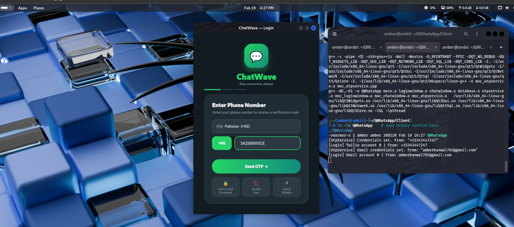
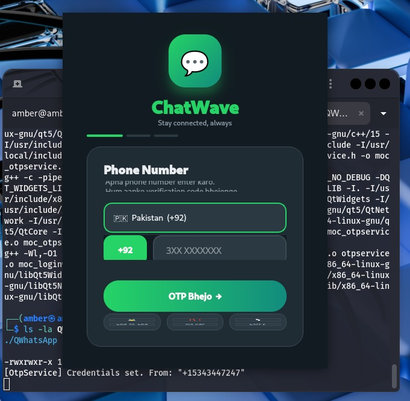
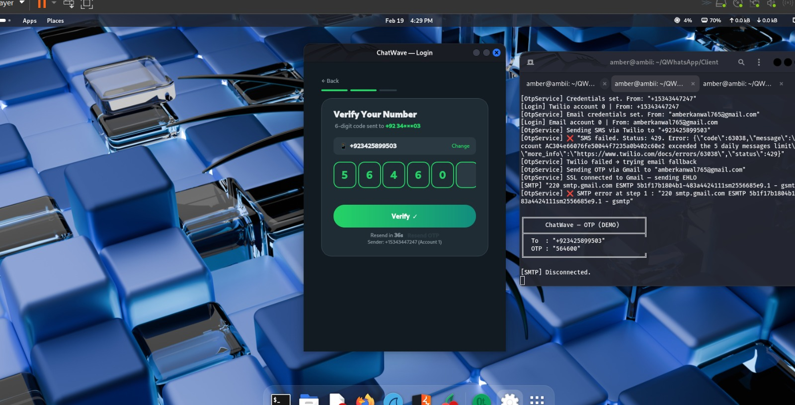
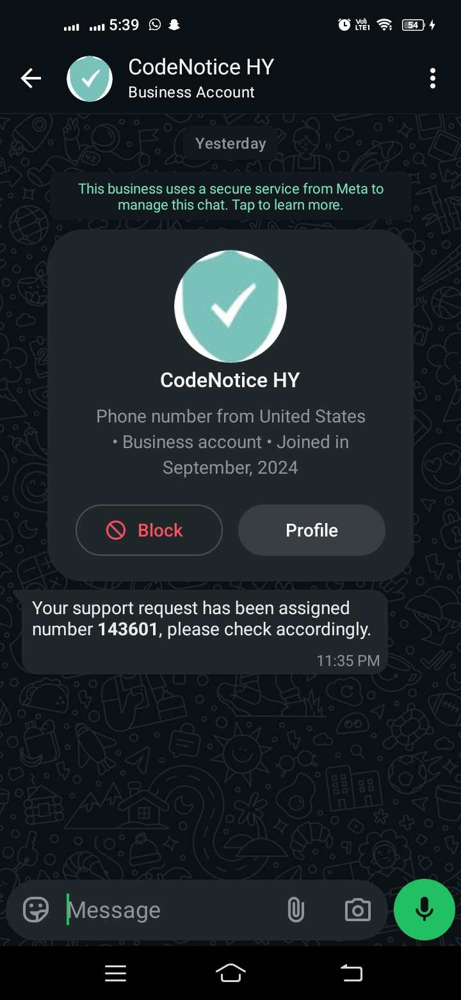
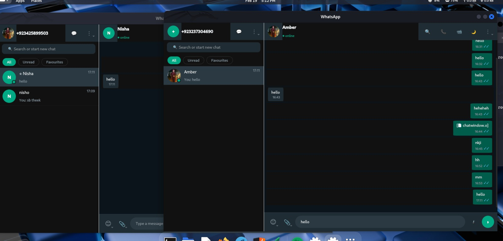
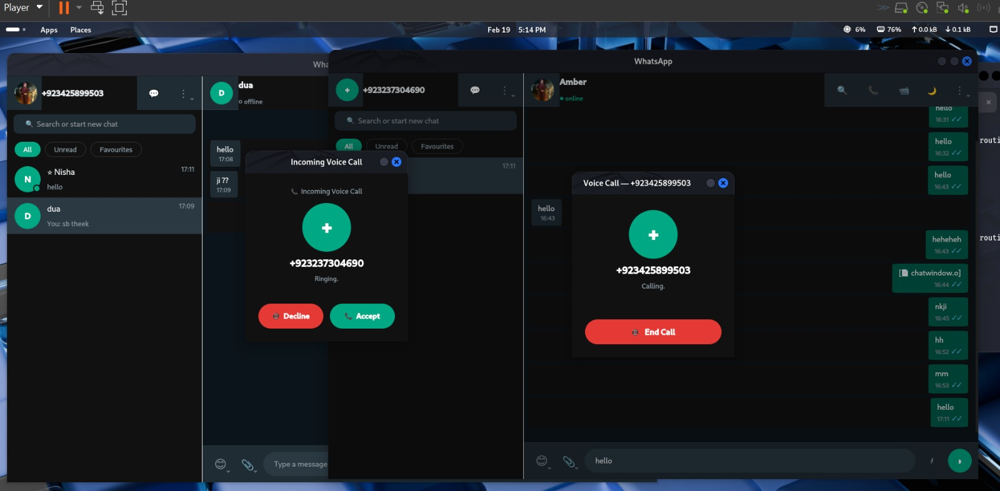
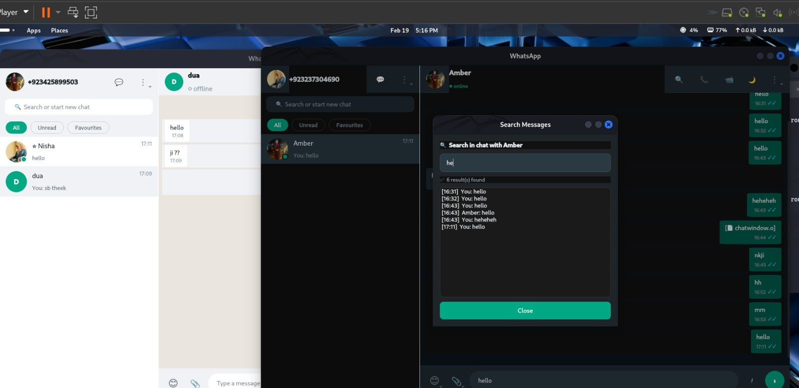
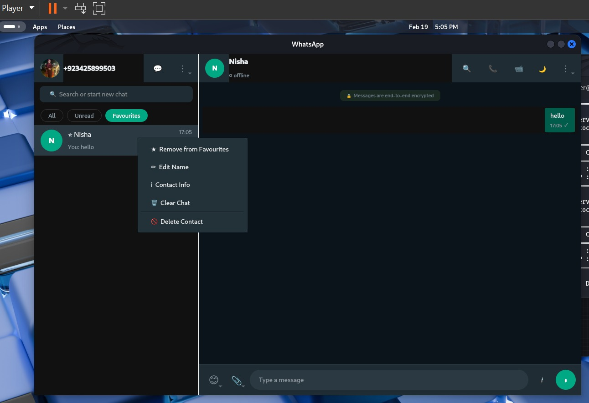

<div align="center">



# 💬 ChatWave — WhatsApp Clone
### A Full-Featured Real-Time Desktop Messaging Application


**Built by [Amber Kanwal](https://linkedin.com/in/amber-kanwal-088b22350) — BS Software Engineering**\n
Contact me for this project amberkanwal183@gmail.com

</div>

---

## 🚀 About The Project

**ChatWave** is a production-level **WhatsApp clone** built entirely from scratch using **C++ and Qt5**, demonstrating deep systems programming knowledge. It replicates core WhatsApp features including real-time messaging, voice calling, OTP-based authentication, and contact management — all running over a custom TCP/IP socket architecture.

> 💡 This project was built to demonstrate mastery of **network programming**, **multi-threading**, **client-server architecture**, and **GUI development** in C++.

---

## ✨ Features

### 🔐 Authentication
- Phone number login with **OTP verification**
- OTP delivered via **Twilio SMS API**
- Automatic fallback to **Gmail SMTP** if SMS fails
- Country code selector (Pakistan +92 supported)

### 💬 Real-Time Messaging
- Multi-client chat using **TCP/IP socket programming**
- **Multi-threaded** server handles concurrent users
- Message **delivery ticks** (single ✓ and double ✓✓)
- Timestamps on all messages

### 📞 Voice Calling
- Incoming voice call with **Accept / Decline** buttons
- Outgoing call with **End Call** control
- Real-time call status (Ringing → Connected)

### 👥 Contact Management
- Add, edit, delete contacts
- Mark contacts as **Favourites** ⭐
- **Filter by:** All / Unread / Favourites
- Online / Offline presence indicators 🟢

### 🔍 Message Search
- Search within any conversation
- Timestamp-indexed results display

### 🌍 Multi-Language UI
- Supports both **Urdu and English** prompts
- Localized login screen

---

## 🛠️ Tech Stack

| Layer | Technology |
|-------|-----------|
| Language | C++ (g++, C++17) |
| GUI Framework | Qt5 (Widgets, Network, SQL, Core, Gui) |
| Networking | TCP/IP Sockets, pthread (Multi-threading) |
| Database | MySQL |
| SMS API | Twilio REST API |
| Email | Gmail SMTP (SSL) |
| Build System | Qt Makefile / g++ |
| Platform | Linux (Ubuntu) |

---

## 📸 Screenshots

<table>
  <tr>
    <td align="center"><b>Login / OTP</b></td>
    <td align="center"><b>OTP Verification</b></td>
  </tr>
  <tr>
    <td></td>
    <td></td>
  </tr>
    <tr>
    <td align="center"><b>SMS</b></td>
    <td align="center"><b>Chat Window</b></td>
  </tr>
  <tr>
    <td></td>
    <td></td>
  </tr>
  <tr>
    <td align="center"><b>Voice Call</b></td>
    <td align="center"><b>Message Search</b></td>
  </tr>
  <tr>
    <td></td>
    <td></td>
  </tr>
  <tr>
    <td align="center"><b>Features </b></td>
    <td align="center"><b>Contacts</b></td>
  </tr>
  <tr>
    <td></td>
    <td></td>
  </tr>
</table>

---

## 🏗️ Architecture
```
┌─────────────────────────────────┐
│           CLIENT (Qt5 GUI)      │
│  LoginWindow → ChatWindow       │
│  OtpService  → ContactManager  │
└────────────┬────────────────────┘
             │  TCP/IP Socket
             ▼
┌─────────────────────────────────┐
│        SERVER (C++ Backend)     │
│  Multi-threaded connection pool │
│  Message routing & delivery     │
└────────────┬────────────────────┘
             │
             ▼
┌─────────────────────────────────┐
│        MySQL Database           │
│  Users │ Messages │ Contacts   │
└─────────────────────────────────┘
```

---

## 🧠 Key Concepts Demonstrated

- ✅ **TCP/IP Socket Programming** — custom client-server protocol
- ✅ **Multi-threading with pthreads** — concurrent client handling
- ✅ **Qt5 Signal/Slot mechanism** — reactive GUI updates
- ✅ **Third-party API Integration** — Twilio & SMTP in C++
- ✅ **Database design** — normalized schema with MySQL
- ✅ **OOP Design Patterns** — clean separation of concerns

---

## 👩‍💻 Developer

**Amber Kanwal**
BS Software Engineering

[](https://linkedin.com/in/amber-kanwal-088b22350)
[](https://github.com/amberkanwal12)
[](https://ambar.nebulaxent.com)

---

<div align="center">
⭐ If you found this project interesting, please give it a star!
</div>
